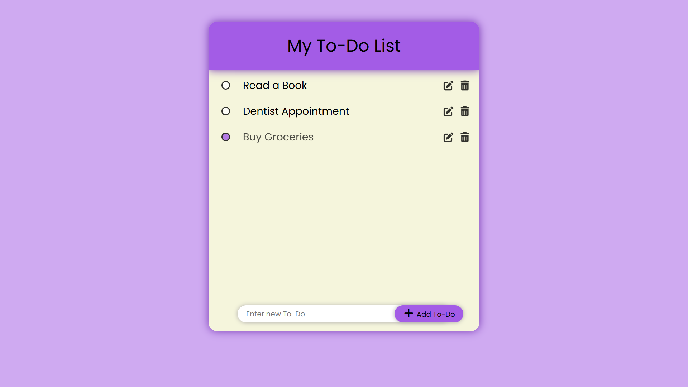

# ✅ To-Do List Web App

A clean and responsive To-Do List app built from scratch using **HTML**, **CSS**, and **JavaScript** — with full keyboard and mobile touch support.

---

## 🔍 Features

- ✅ Add new tasks
- ✏️ Edit existing tasks (inline)
- ❌ Delete individual tasks
- 📱 Mobile-friendly (supports `click` + `touchend`)
- 💬 Shows “no tasks” message when list is empty
- 🔁 Input validation and dynamic updates
- 🎨 Custom scrollbars and neat responsive UI

---

## 📱 Built With

- HTML5  
- CSS3  
- JavaScript (Vanilla)  
- Font Awesome (for icons)

---

## 🚀 Live Demo

🔗 [Check it out here](https://rutupatil27.github.io/Todo_List/)  

---

## 🛠️ What I Learned

- How event handling differs across devices (desktop vs mobile)
- Why `click` isn’t enough — and how `touchend` improves mobile UX
- Handling focus/blur issues and keyboard-triggered behavior
- Importance of testing UI on real devices and real browsers

---

## 📸 Screenshots

| Desktop                         | Mobile                          |
|-------------------------------|---------------------------------|
|  |  |  

---
